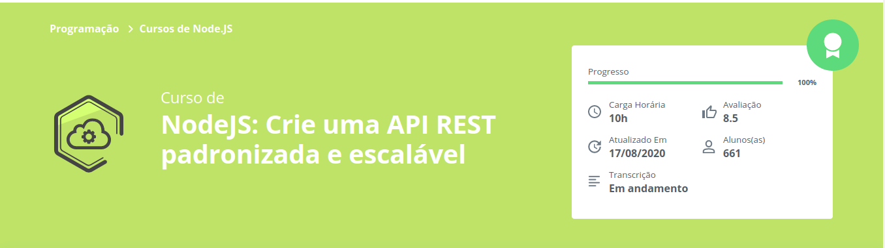

# NodeJs: API RESTful padronizada e escalável
Repositório criado para acompanhar e fixar curso de NodeJs da [Alura](https://www.alura.com.br/)
## Conhecimentos Adquiridos
- [x] Criar API seguindo convenção REST
- [x] Arquitetura de APIs escaláveis
- [x] Trabalhar com informações passadas por Cabeçalho
- [x] Criar Serializador para organizar e converter dados durante a troca de informações da API
## Cursos Implementados
[NodeJS: Crie uma API REST padronizada e escalável](https://cursos.alura.com.br/course/nodejs-api-rest-padronizada-escalavel)
